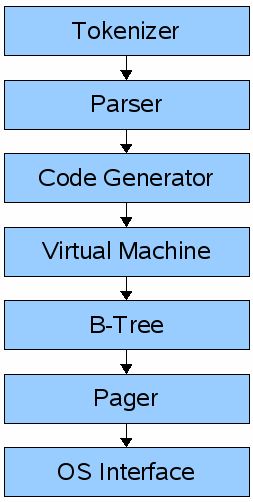
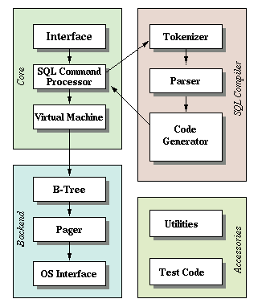

# CPP SQLITE

C++ implementation of the sqlite clone written in C in the article series [Let's Build a Simple Database](https://cstack.github.io/db_tutorial/).

## Sqlite Architecture

Front-end:
- Tokenizer
- Parser
- Code Generator

The input to the front-end is a SQL query. the output is sqlite virtual machine bytecode (essentially a compiled program that can operate on the database).

Back-end:
- Virtual Machine: takes bytecode generated by the front-end as instructions. It can then perform operations on one or more tables or indexes, each of which is stored a B-tree. The VM is essentially a big switch statement on the type of bytecode instruction.
- B-tree: Each B-tree consists of many nodes. Each node is one page in length. The B-tree can retrieve a page from disk or save it back to disk by issuing commands to the pager.
- Pager: The pager receives commands to read or write pages of data. It is responsible for reading/writing at appropriate offsets in the database file. It also keeps a cache of recently-accessed pages in memory, and determines when those pages need to be written back to disk.
- OS interface

The “front-end” of sqlite is a SQL compiler that parses a string and outputs an internal representation called bytecode.

This bytecode is passed to the virtual machine, which executes it.

